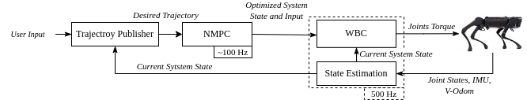

# Unitree RL+MPC Project
## Goal:
- Implement an RL+MPC framework, that can improve sim2real performance
- Deploy on Go2 and G1

## Plan
### Phase 1
- Get familiar with legged_control framework (MPC codebase), and unitree_rl_gym framework (RL codebase)
- Reimplement A1 legged_control on Go2(sim)

### Phase 2
- Reimplement G1_control on G1(sim)
- Deploy legged_control on Go2

### Phase 3
- Use RL statistics to initialize MPC params
- Deploy on G1
- Other optimizations...

## System Framework Introduction

### Goal setting and transferring
- Robot's goal vel or pos(move forward, turn etc.) will be transferred to state trajectory, then input to NMPC
- NMPC will calculate a optimal system state and input(acc, moment etc.)
### Whole Body Controller(WBC)
- WBC calculates torque of all joints based on NMPC's output(i.e. optimal state and input)
- This result serves as feed-forward, will be passed to robot's controller, generate optimal joint position and velocity's PD control command. This can reduce the viberation of the feet when contacting to the ground, hence impove the performance of tracking.
### State estimation
- Both NMPC and WBC requires robot's state, like robot's base orientation, joint state etc. Those are acquired by subscribing IMU and sensors.
- Kalman Filter(KF) is used to estimate base position and velocity of robot. Estimated by orientation, acceleration and foot positions.
